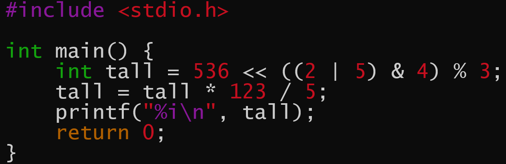
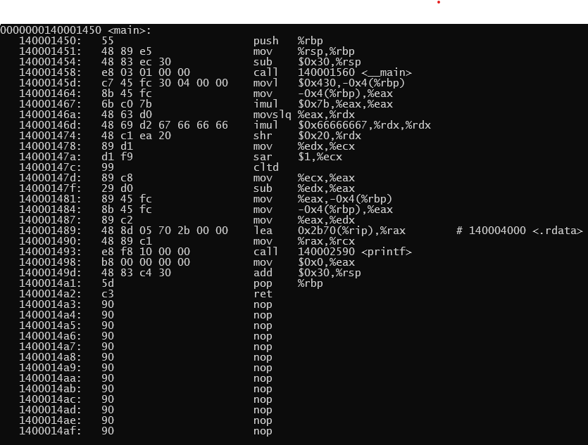
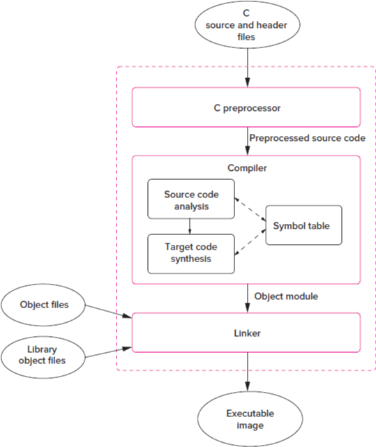

---
title:
- "INF-0103 Kompilering og header-filer"
author:
- "Jakob Peder Pettersen, UiT – Norges arktiske universitet"
theme:
- default
colortheme:
- seagull
aspectratio:
- 169
font:
- serif
fontsize:
- 14pt
date:
- "Høst 2025"
---

# Dagens tema

* Tolkede og kompilerte programmeringsspråk

* Kompileringsprosessen

* Bruk av preprosessor

* Header-filer

* Lage program av flere kildekodefiler

# Hvorfor programmeringsspråk?

* Prosessoren forstår bare maskinkode
* Mennesker er dårlige til å skrive maskinkode
* Løsning: Mennesket skriver programmet i et høynivåspråk som oversettes til maskinkode

{ width=300px } { width=200px }


# Hvordan oversette?

To hovedløsninger:

* Tolker: Oversettelsen skjer når programmet kjører
* Kompilator: Programmet blir oversatt til ei fil i maskinkode som deretter kan kjøres

# 

{ width=200px }

#

{ width=400px }

# Hvorfor ikke bare bruke Python?

* Ytelse (tolkeren spiser av lasset)
* Mer direkte kontrol over maskinvare
* Mer direkte kommunikasjon med operativsystem og andre programmer
* Kompilatoren oppdager (noen) feil
* Tolkeren er jo også et program

# Kompileringsprosessen

Nøkkelkonsept: Oversettelsesenhet (*Translational unit*)

Tre hovedsteg:

* Preprosessering (separat for hver oversettelsesenhet)
* Kompilering (separat for hver oversettelsesenhet)
* Lenking (oversettelsesenhetene kombineres)

Kompilatoren tar som standard alle stegene i et jafs, men vi kan dele dem opp

#
{ width=200px }

# Preprosessoren

* Kjører før kompilering
* Instruksjoner begynner med `#`
* Alle instruksjoner er på sin egen linje, ingen semikolon nødvendig
* Er en ren tekstprosessor, ignorerer strukturen til programmet

# Viktige proprosessorinstruksjoner (*directives*)

```C
#include "header.h"
```
inkluderer (limer inn) headerfil (fra lokal mappe)

```C
#include <stdio.h>
```
inkluderer systemheader (fra systemets katalogsti)

```C
#define PI 3.14159265
```
definerer makro

```C
#define SUM(x,y) x + y
```
definerer makro med parameter

# Oppgave: Hva skriver dette programmet ut?

```C
#include <stdio.h>

#define SUM(x, y) x + y

int main() {
    int a, b, c;
    a = 3;
    b = 5;
    c = 2;
    int res = a * SUM(b, c);
    printf("%d", res);
    return 0;
}
```

# Minimer bruk av preprosessor

* Deklarer konstanter som konstante variabler
```C
static const double PI = 3.14159265;
```

* Foretrekk funksjoner framfor makroer
```C
static int sum(int a, int b) {
    return a + b;
}
```

* Bruk `static` for funksjoner og konstanter som **ikke** skal deles med andre oversettelsesenheter

# Hva er ei headerfil?

* C-fil lagd for å inkluderes
* Inkludering av andre header-filer
* Funksjonsdeklarasjoner
* Definisjoner
* Konstanter

# Header guard

* I større prosjekter: Lett at samme headerfil blir inkludert to ganger
* Det går vanligvis dårlig
* Løsning: `#include` guard som forhindrer at dette skjer

```C
#ifndef NAVN_H
#define NAVN_H
// Resten av header
#endif
```

* Ikke-standard, men enklere løsning (støttes av de fleste moderne kompilatorer): `#pragma once`

# Make-fil

* Automatiserer byggingen av prosjekter
* Egen syntaks

# Prosjekt med flere filer

#
{ width=400px }
