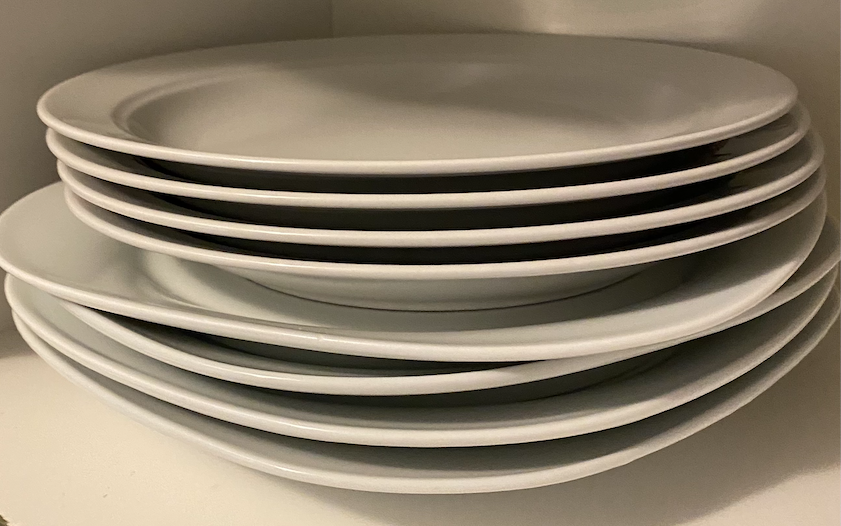

---
title:
- "INF-1100: Stack, call stack, og heap"
author:
- "Einar Holsbø, UiT – Norges arktiske universitet"
theme:
- default
colortheme:
- seagull
aspectratio:
- 169
font:
- serif
date:
- "H25"

---

# Oversikt

* Datastrukturen stack (eng.): hva er det og hvordan brukes det?
* Stacken, (aka. "the call stack"): hvordan gjøres funksjonskall?
* Rekursjon: Hva er det og hvordan kan vi løse problemer med det?


# _Stack_ er engelsk for _stabel_

{ width=200px }

* Vi stabler "nederst til øverst"
* Vi tar ting ut "øverst til nederst"
* En stabel av tallerkener er __Last In, First Out (LIFO)__

# En _stack_ er en LIFO datastruktur (tegning)
 * Å legge noe inn kalles en __push__
 * Å ta noe ut kalles en __pop__

# Aktivitet: fullfør programmet 
```C
#include <stdio.h>

char STACK[128];              // holds stack data

void push(char ch) {          // implement me
}

char pop() {                  // implement me
}

int main() {
  push(1); push(2); push(3);
  // should print 3 2 1
  printf("%d ", pop()); printf("%d ", pop()); printf("%d\n", pop());
}
```

# Løsningsforslag [https://bit.ly/3l2kzg7](https://bit.ly/3l2kzg7)
```C
char STACK[128];              // holds stack data
int top = 0;

void push(char ch) {
	STACK[top] = ch;          // place ch on top
	top = top + 1;            // increment pointer
}

char pop() {
	top = top - 1;            // decrement pointer
	return STACK[top];        // return item (will be overwritten on next push)
}
```

# Diskusjon
## Denne løsninga flytter en peker; hva med å flytte data i stedet?
1. vil det fortsatt være en stack?
2. vil det være "like bra"?

#

# Eksempel: streng i revers [https://bit.ly/3B3l8eV](https://bit.ly/3B3l8eV)
```C
char hello[] = "Helloworld";

int i = 0;

// push until terminating zero
while (hello[i] != 0) {
  push(hello[i]);
  i ++;
}

// match number of pop with number of push!
for (int j = 0; j < i; j ++) {
  hello[j] = pop();
}

printf("%s\n", hello);     // prints dlrowolleH
```

#
## The Call Stack (stacken)

# Funksjoner trenger plass i minne til argumenter, returverdi, og arbeidsvariabler
```C
char subtract(char a, char b) {
  return a - b;
}
```

To muligheter:

. . .

## 1) Sett av en fast plass i minnet til hver funkjson
* Lett å implementere
* Funksjoner kan aldri kalle seg selv (hvorfor?)

. . .

## 2) Sett av en bit med minne for hvert __kall__ til en funksjon

* Enkelt hvis man bruker en stack
* Funksjoner kan kalle seg selv


# Einar-style assembly for kallet til `subtract` + tegning
## C:
```C
char diff = subtract(6, 5);
```

## E.-s. assembly:
```
    PUSH 5                  // put arguments on stack
    PUSH 6              
    CALL subtract           // jump to subtract code
    POP r1                  // pop return value into register 1
    ...
# subtract:
    POP r2                  // pop argument into register 2
    POP r3                  // pop argument into register 3
    SUB $(r3), $(r2), r2    // subtract value in r2 from r3, store in r2
    PUSH $(r2)              // push the result in r2
    RETURN                  // jumps back via return ptr
```

# Noen funksjoner som kaller hverandre
## Psevdokode:
```C
int a(int arg) { ...; ret_b = b(arg); ...;  }
int b(int arg) { ...; ret_c = c(arg); ...;  }
```
## Call Stack
```


----- STACK -------
|                 |
|                 |
|                 |
|                 |
|                 |<-- toppen av stack
-------------------
```

# Noen funksjoner som kaller hverandre
## Psevdokode:
```C
int a(int arg) { ...; ret_b = b(arg); ...;  }
int b(int arg) { ...; ret_c = c(arg); ...;  }
```
## Call Stack
```

Vi kaller a( ... )


----- STACK -------
|                 |
|                 |
|                 |
|                 |
|                 |<-- toppen av stack
-------------------
```

# Noen funksjoner som kaller hverandre
## Psevdokode:
```C
int a(int arg) { ...; ret_b = b(arg); ...;  }
int b(int arg) { ...; ret_c = c(arg); ...;  }
```
## Call Stack
```

Vi kaller a( ... )


----- STACK -------
|                 |
|                 |
|                 |
|                 |<-- toppen av stack
| a() STACK FRAME |
-------------------
```


# Noen funksjoner som kaller hverandre
## Psevdokode:
```C
int a(int arg) { ...; ret_b = b(arg); ...;  }
int b(int arg) { ...; ret_c = c(arg); ...;  }
```
## Call Stack
```

a( ... ) kaller på b( ... )


----- STACK -------
|                 |
|                 |
|                 |
|                 |<-- toppen av stack
| a() STACK FRAME |
-------------------
```

# Noen funksjoner som kaller hverandre
## Psevdokode:
```C
int a(int arg) { ...; ret_b = b(arg); ...;  }
int b(int arg) { ...; ret_c = c(arg); ...;  }
```
## Call Stack
```

a( ... ) kaller på b( ... )


----- STACK -------
|                 |
|                 |
|                 |<-- toppen av stack
| b() STACK FRAME |
| a() STACK FRAME |
-------------------
```

# Noen funksjoner som kaller hverandre
## Psevdokode:
```C
int a(int arg) { ...; ret_b = b(arg); ...;  }
int b(int arg) { ...; ret_c = c(arg); ...;  }
```
## Call Stack
```

b( ... ) kaller på c( ... )


----- STACK -------
|                 |
|                 |
|                 |<-- toppen av stack
| b() STACK FRAME |
| a() STACK FRAME |
-------------------
```

# Noen funksjoner som kaller hverandre
## Psevdokode:
```C
int a(int arg) { ...; ret_b = b(arg); ...;  }
int b(int arg) { ...; ret_c = c(arg); ...;  }
```
## Call Stack
```

b( ... ) kaller på c( ... )


----- STACK -------
|                 |
|                 |<-- toppen av stack
| c() STACK FRAME |
| b() STACK FRAME |
| a() STACK FRAME |
-------------------
```

# Noen funksjoner som kaller hverandre
## Psevdokode:
```C
int a(int arg) { ...; ret_b = b(arg); ...;  }
int b(int arg) { ...; ret_c = c(arg); ...;  }
```
## Call Stack
```

c( ... ) returnerer


----- STACK -------
|                 |
|                 |<-- toppen av stack
| c() STACK FRAME |
| b() STACK FRAME |
| a() STACK FRAME |
-------------------
```

# Noen funksjoner som kaller hverandre
## Psevdokode:
```C
int a(int arg) { ...; ret_b = b(arg); ...;  }
int b(int arg) { ...; ret_c = c(arg); ...;  }
```
## Call Stack
```

c( ... ) returnerer


----- STACK -------
|                 |
|                 |
|                 |<-- toppen av stack
| b() STACK FRAME |
| a() STACK FRAME |
-------------------
```

# Noen funksjoner som kaller hverandre
## Psevdokode:
```C
int a(int arg) { ...; ret_b = b(arg); ...;  }
int b(int arg) { ...; ret_c = c(arg); ...;  }
```
## Call Stack
```

b( ... ) returnerer


----- STACK -------
|                 |
|                 |
|                 |<-- toppen av stack
| b() STACK FRAME |
| a() STACK FRAME |
-------------------
```

# Noen funksjoner som kaller hverandre
## Psevdokode:
```C
int a(int arg) { ...; ret_b = b(arg); ...;  }
int b(int arg) { ...; ret_c = c(arg); ...;  }
```
## Call Stack
```

b( ... ) returnerer


----- STACK -------
|                 |
|                 |
|                 |
|                 |<-- toppen av stack
| a() STACK FRAME |
-------------------
```

# Noen funksjoner som kaller hverandre
## Psevdokode:
```C
int a(int arg) { ...; ret_b = b(arg); ...;  }
int b(int arg) { ...; ret_c = c(arg); ...;  }
```
## Call Stack
```

a( ... ) returnerer


----- STACK -------
|                 |
|                 |
|                 |
|                 |<-- toppen av stack
| a() STACK FRAME |
-------------------
```

# Noen funksjoner som kaller hverandre
## Psevdokode:
```C
int a(int arg) { ...; ret_b = b(arg); ...;  }
int b(int arg) { ...; ret_c = c(arg); ...;  }
```
## Call Stack
```

a( ... ) returnerer


----- STACK -------
|                 |
|                 |
|                 |
|                 |
|                 |<-- toppen av stack
-------------------
```

# Noen funksjoner som kaller hverandre
## Psevdokode:
```C
int a(int arg) { ...; ret_b = b(arg); ...;  }
int b(int arg) { ...; ret_c = c(arg); ...;  }
```
## Call Stack
```


                   Stack frame blir plassen i minnet 
                   som brukes til funksjonens data:
                   allokeres for hvert funksjonskall


```

#
## Hvor er `main` sine variabler?

# Tegning igjen: minneallokering + peker
```C
int main() {
    int *result;

    // stuff happpens...

    result = malloc(sizeof(int));
    
    // ...

    *result = 12345;

    // ...

    return 0;
}
```

# Aktivitet: funksjonskall med stack  
Den nederste koden bruker stacken fra tidligere til å returnere resultatet.
Endre koden til også å bruke stacken til argumentene!

## Vanlig funksjonskall
```C
char subtract(char a, char b) {
  return a - b;
}
```

## Med stack [https://bit.ly/3B0WJXz](https://bit.ly/3B0WJXz) (løsningsforslag [https://bit.ly/2YplKxo](https://bit.ly/2YplKxo))
```C
void subtract(char a, char b) {
  push(a - b);
}
int main() {
  subtract(6, 5);
  printf("6 - 5 = %d\n", pop());
}
```

# Løsningsforslag [https://bit.ly/2YplKxo](https://bit.ly/2YplKxo)
```C
void subtract() {
	char a = pop();
	char b = pop();
	push(a - b);            
}

// i main blir det (har ikke plass til alt på slide):
	push(5);
	push(6);
	subtract();
	printf("6 - 5 = %d\n", pop());
```

## 
```
    PUSH 5                  // put arguments on stack
    PUSH 6              
    CALL subtract           // jump to subtract code
    POP r1                  // pop return value into register 1
```

